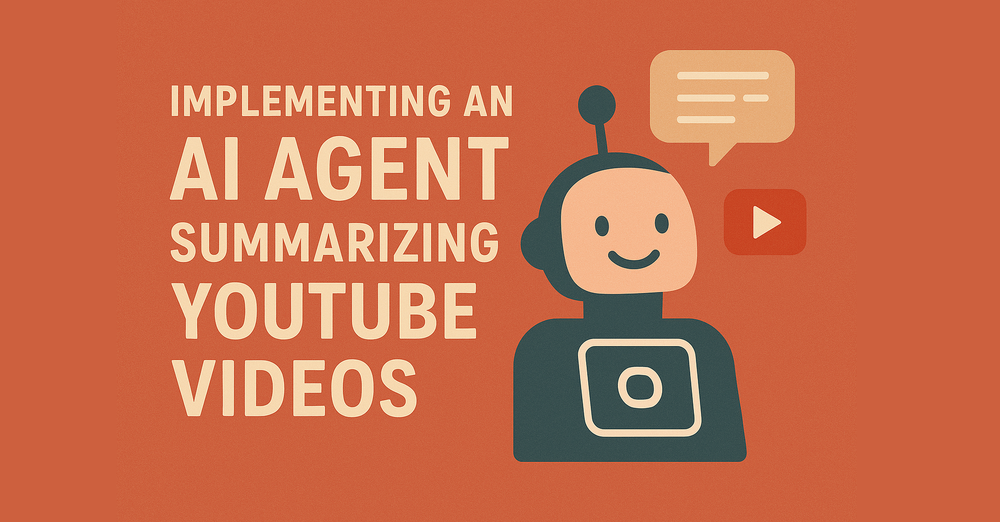

# Image Classifier AI Agents with Neuron AI PHP framework

> Read the full article: https://inspector.dev/php-ai-agent-summarizing-youtube-videos/



This repository contains the PHP implementation of an AI Agents summarizing YouTube videos.
It is built using the [Neuron AI](https://github.com/inspector-apm/neuron-ai) package.

# Vision Capabilities Use Cases
Most advanced LLMs can understand images other than simple text. With Neuron, you can attach images to your messages 
to leverage the vision capability of your AI provider.

The most common use cases for Image analysis are:

- Caption and answer questions about images
- Transcribe and reason over image content
- Detect objects in an image and return bounding box coordinates for them
- Segment objects within an image

# Introducing the Neuron AI PHP framework
Neuron is a fantastic PHP package that allows you to create full-featured AI Agents in PHP in a few lines of code. 
It definitively fills the gap for AI Agents development between PHP and other ecosystems like Python or Javascript.

It provides you with a standard toolkit to implement AI-driven applications drastically reducing vendor lock-in. 
You can switch between LLMs, vector stores, embedding providers, etc. with just a few lines of code without the 
need to refactor big portions of your application.

Also, being able to encapsulate the full implementation of the Agent into a single class makes it so easy 
to add AI features within your existing PHP application.

If you are new to AI Agents development, or you already have experience, Neuron can be the perfect playground 
to move your idea from experiments to extensive production implementations.

Here is the link to the documentation: https://docs.neuron-ai.dev

# How to use this project

Download the project on your machine and open your terminal into the project directory.
First, install the composer dependencies:

```
composer install
```

Rename the `.env.example` into `.env` and provide the script with the Anthropic API key, 
and the [Inspector](https://inspector.dev) ingestion key if you want to monitor the agent execution:

```dotenv
ANTHROPIC_API_KEY=
INSPECTOR_INGESTION_KEY=
```

To interact with the agent, you can run the `vision.php` script:

```
php public/vision.php
```

# Agent Monitoring
The Inspector team designed Neuron AI with built-in observability integration backed by [Inspector.dev](https://inspector.dev/),
so you can monitor AI agents were running for error detection and performance analysis.
Inspector helps you move your agents from prototype to production with confidence.

To enable the Agent monitoring, you need to provide the Inspector ingestion key in the `.env` file.
You get a new key registering an account on the [Inspector](https://inspector.dev/) website.

```dotenv
INSPECTOR_INGESTION_KEY=m849w7g8xxxxxxxxxxxxxxxxxxxxxxxxxxx
```

Now, when you run the agent you will be able to explore its internal execution flow in the Inspector dashboard,
and be alerted for unpredictable errors via email.


## Inspector.dev
[Inspector](https://supadata.ai) is a code execution monitoring tool for the PHP ecosystem.

It provides full visibility into the AI Agent execution flow. Learn more on the Neuron documentation:
https://docs.neuron-ai.dev/advanced/observability

## Full Article
Here is the link to the article about this implementation: https://inspector.dev/php-ai-agent-summarizing-youtube-videos/